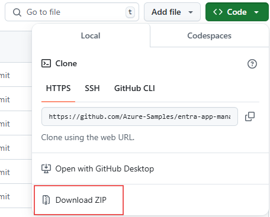

# Introduction
This PowerShell script [UpdateAppManagementPolicies](#running-the-script) is intended to update application management policies in Entra ID in preparation of a change in behavior that will come into effect early December 2024.

If you just want to learn how to run the script, jump to [that section](#running-the-script).

# Background

[App management policies](https://learn.microsoft.com/en-us/graph/api/resources/applicationauthenticationmethodpolicy) allow you, as an administrator of a tenant, to set rules about how applications in your tenant can be configured.  For example, you can block the addition of password credentials, or set a max lifetime on certificate credentials:

```http
/policies/defaultAppManagementPolicy

{
    "id": "00000000-0000-0000-0000-000000000000",
    "displayName": "Default app management tenant policy",
    "description": "Default tenant policy that enforces app management restrictions on applications and service principals. To apply policy to targeted resources, create a new policy under appManagementPolicies collection.",
    "isEnabled": false,
    "applicationRestrictions": {
        "passwordCredentials": [
            {
                "restrictionType": "passwordAddition",
                "maxLifetime": null,
                "restrictForAppsCreatedAfterDateTime": null
            }
        ],
        "keyCredentials":[
            {
                "restrictionType": "asymmetricKeyLifetime",
                "maxLifetime": "P30D",
                "restrictForAppsCreatedAfterDateTime": null
            }
        ]
    },
    "servicePrincipalRestrictions": {
        "passwordCredentials": [],
        "keyCredentials":[]
    }
}
```

Typically, you'll do this by configuring the [tenant default policy](https://learn.microsoft.com/en-us/graph/api/resources/tenantappmanagementpolicy?view=graph-rest-1.0).  This will enforce the rule for every app in the tenant.

You can also use [custom app management policies](https://learn.microsoft.com/en-us/graph/api/resources/appmanagementpolicy?view=graph-rest-1.0) to configure custom policies.  When a custom app management policy is applied to an application or service principal, it fully overrides the tenant default policy - meaning no aspect of the tenant default policy applies to the app, and custom app management policies do not inherit from the default policy.  For example, if your tenant had the default policy defined above, and then you applied the below custom policy to an app:

```http
/policies/appManagementPolicies/db9d4b58-3488-4da4-9994-49773c454e33

{
  "id": "db9d4b58-3488-4da4-9994-49773c454e33",
  "displayName": "Custom app management policy",
  "description": "Custom policy that enforces app management restrictions on specific applications and service principals.",
  "isEnabled": false,
  "restrictions": {
    "passwordCredentials": [
      {
          "restrictionType": "passwordLifetime",
          "maxLifetime": "P4DT12H30M5S",
          "restrictForAppsCreatedAfterDateTime": null
      }
    ],
    "keyCredentials": []
  }
}
```

then that application would **only** have the `passwordLifetime` restriction applied to it.  The `passwordAddition` and `keyLifetime` restrictions would not apply - meaning the application would still be able to add passwords, and add certificate credentials with any lifetime.

However, a change is coming to this functionality.  Starting in early December 2024, custom policies that don't explicitly define a restriction will inherit the behavior defined in the tenant default policy.  **If you have defined a custom app managemement policy before November of 2024, you need to take action to ensure your policies continue to work as expected**.  Keep reading for more information on this behavior update to the app management policies. 

# Behavior update
We have introduced a new property, `state`, on the restriction type, with possible values `enabled`, `disabled`.

```http
{
  ...
  "restrictions": {
    "passwordCredentials": [
      {
          "restrictionType": "passwordLifetime",
          "maxLifetime": "P4DT12H30M5S",
          "restrictForAppsCreatedAfterDateTime": null,
          "state": "enabled"
      }
    ],
    "keyCredentials": []
  }
  ...
}
```

If the `state` of a restriction is `enabled`, the restriction will be evaluated and enforced, else if the `state` is `disabled` the restriction will not be evaluated or enforced.  This property is already available to set in the `beta` version of the [Application Management Policies API](https://learn.microsoft.com/en-us/graph/api/resources/passwordcredentialconfiguration?view=graph-rest-beta#properties).

Starting in early December 2024, only restrictions that are explicitly defined on the custom app management policy will override the tenant default policy.  You can leverage the `state` flag on the custom policy to turn the restriction on or off explicitly - otherwise, don't specify anything to fall back to the tenant default behavior.

For example, say your tenant had a default policy like the one defined in the 'background' section - where both password addition and key lifetime restrictions were set.  If you wanted a custom app managemnt policy that would only give an exception to the password addition restriciton, you could create the following policy:

```http
/policies/appManagementPolicies/{id}

{
  "id": "db9d4b58-3488-4da4-9994-49773c454e33",
  "displayName": "Custom app management policy",
  "description": "Custom policy that gives an exception to just the password addition restriction",
  "isEnabled": false,
  "restrictions": {
    "passwordCredentials": [
      {
          "restrictionType": "passwordAddition",
          "maxLifetime": null,
          "state": "disabled"
      }
    ],
    "keyCredentials": []
  }
}
```

Applying this policy to the app would give it an exception to the password addition restriction, so the app would be able to add a password.  The key lifetime restriction is not defined on the policy, so the tenant default policy would continue to apply - the app would be blocked from adding a certificate with too long of a lifetime.

## Why are you changing this behavior?

This will improve policy exception handling and reduce policy management complexity.  For example, with this change, when you add a new restriction to your tenant default policy, you don't need to backfill that restriction into all of your app management policies - the restriction will apply by default. 

# What does this mean for my existing policies?  What action do I need to take to make sure they continue to work as expected?

Your existing policies will need to be updated before this feature is enabled, or they will start working unexpectedly.  This is because, previously, exceptions to restrictions in the tenant default policy were indicated by a *lack* of the restriction in the custom app management policy; once this feature is enabled, those same exceptions will be granted through a *disabled* restriction.

The Entra ID team has created a PowerShell script that will apply the needed updates to your application policies. **The only action required from you is to [run the script](#running-the-script) before December 4, 2024.**

The script scans the tenant for tenant-wide and custom application management policies and sets the `state` property as `enabled` where the restrictions are already defined and state is not yet set. Additionally the script adds new restrictions on all app specific policies that are missing in the app specific policy but defined on the tenant wide policy, but sets the `state` for these new restrictions as `disabled`

# How do I know if I need to run the script?
This script only needs to be run if the tenant has any custom app management policies that were created on or before November 4, 2024.

If you are not sure if this applies to you, check for the presence of app management policies in your tenant.  You can do this by signing into [MS Graph explorer](https://aka.ms/ge) and making the following request:

```
GET https://graph.microsoft.com/v1.0/policies/appManagementPolicies
```

If there are any policies returned from that request, you should run this script.  If not, you don't need to run this script.

# Running the script

## Prerequisites and setup
- The user identity running the PowerShell script has the `Global Administrator` or `Application Administrator` role assignment.
- You need to have the [Microsoft Graph Powershell SDK](https://learn.microsoft.com/en-us/graph/sdks/sdk-installation#install-the-microsoft-graph-powershell-sdk) installed.  If you don't, from a Powershell window, run 

  ```PowerShell
  Install-Module Microsoft.Graph -Scope CurrentUser
  ```

- To run the command that executes this script, you need to get the files in this repo onto your local machine.  To do this, you can clone the repo locally.  Or, you can download and extract the files:
  1. Download this repo's files as a ZIP to your local machine
       
  1. Extract them to whatever location you prefer (e.g., "C:\Users\myUserAccount")
  1. Open a Powershell window, and navigate to this folder.
      ```PowerShell
      cd "C:\Users\myUserAccount\entra-app-management-policy-script"
      ```

## How-to?
There are 2 modes to run the script.  We recommend first running with What-If mode ON.  Then, run with What-If mode OFF to actually apply the policy updates

Note: if you get an error message like `File cannot be loaded. The file
<fileName> is not digitally signed. You
cannot run this script on the current system`, jump to [the FAQ](#faq).

### What-If mode ON
This runs the scripts and logs all current application management policies, along with what the policies would be updated to, but doesn't actually update the policies in Entra ID

Command:

```PowerShell
./UpdateAppManagementPolicies.ps1 -WhatIf $true
```

### What-If mode OFF
This runs the scripts, logs all application management policies and also updates the policies in Entra ID

Command:

```PowerShell
./UpdateAppManagementPolicies.ps1 -WhatIf $false
``` 

## Support for Non-Public clouds
The script supports non-public clouds via the -Environment variable similar to [Connect-MgGraph -Environment <ENV_NAME>](https://learn.microsoft.com/en-us/powershell/module/microsoft.graph.authentication/connect-mggraph?view=graph-powershell-1.0&viewFallbackFrom=graph-powershell-beta#-environment)

```PowerShell
./UpdateAppManagementPolicies.ps1 -Environment USGov -WhatIf $true
```

## Support for specific TenantId
The script supports login to a specifc tenant via the -TenantId variable similar to [Connect-MgGraph -Tenant <TenantId>](https://learn.microsoft.com/en-us/powershell/module/microsoft.graph.authentication/connect-mggraph?view=graph-powershell-1.0&viewFallbackFrom=graph-powershell-beta#-tenantid)

```PowerShell
./UpdateAppManagementPolicies.ps1 -TenantId <YOUR_TENANT_ID> -WhatIf $true
```

## Credentials
When prompted, login with the user identity with `Global Administrator` or `Application Administrator` role assignment in the target tenant.

## FAQ

### When I try to run the script, I get an error like "The file is not digitally signed. You cannot run this script on the current system"

This is happening because of Powershell execution policies on your machine.  To override them temporarily (just for the current session), run:

```PowerShell
Set-ExecutionPolicy -Scope Process -ExecutionPolicy Unrestricted
```

### Your docs say that this 'inheritance' feature has already been turned on, but it's not December 4 yet.  What gives?

Yes, our [documentation](todo) describes tenant-wide policies and custom app policies as working how they will once this feature is enabled - where restrictions not defined in the custom policy inherit the behavior of the tenant default policy.

This is because, in early November 2024, this inheritance behavior was enabled for all tenants (a.k.a. organizations) **except** those who had custom policies already defined.  For tenants with existing custom policies already defined, this behavior will be enabled in early December 2024 (to give those tenants time to run this script).

### What happens if I don't run the script?

Your application policies will start working unexpectedly after early December 2024.  Specifically, applications that previously had been granted exceptions to your tenant default policy restrictions will no longer have those exceptions.

### Will running the script cause any change in behavior now?

No, there will be no change in current behavior of the policies.  This change simply ensures your policies continue to work as expected after early December 2024.

###  Can I run the script multiple times?

Yes, the script operation is idempotent, running the script multiple times will yeild the same result.

### Is there a way to undo the changes once the script has been run?

The script has no option to undo the changes once it is run. But policies can still be updated using MS Graph API or MS Graph PowerShell. Please use the What-If mode (ON) to inspect the changes to the policies before running the script.

### Are there any other ways to fix the policies?

Yes, the MS Graph API (beta) already supports the new `state` property. Admins can use the API to update the policies directly and set the `state` properties. The script simply automates this process.

